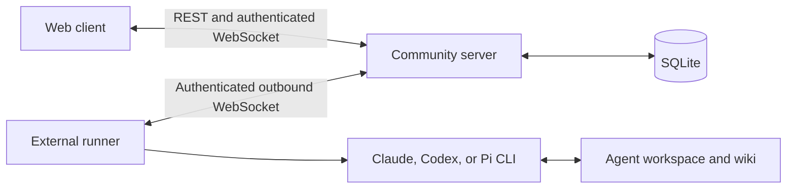

# Current architecture

This describes the mounted implementation as of 2026-09-05. Product scope is
defined in `DECISIONS.md` §22–§24. Future memory and hosting ideas are labeled
separately in the [documentation index](README.md).

## Components

The server owns identities, memberships, conversations, and published card
copies. It never invokes a model. The runner owns provider execution and
the writable agent workspace. The CLI owns its provider login. These are
separate concerns even when all processes run on one laptop.

| Area | Start here | Responsibility |
|---|---|---|
| Web boot | `apps/web/src/main.tsx`, `router.tsx`, `App.tsx` | TanStack Router, application mount, developer-only `#figures` |
| Account | `apps/web/src/components/hosted.tsx` | Restore session, one-time token backup, zero-community onboarding |
| Workspace | `apps/web/src/components/hosted-surface.tsx` | Tenant snapshot hydration and actions mapped into the shared context |
| Interface | `apps/web/src/components/workspace/`, `src/routes/` | Shell, routed surfaces, task dialogs, and auxiliary panels |
| Web transport | `apps/web/src/lib/hosted-api.ts` | Zod-validated REST and browser WebSocket boundary |
| Server boot | `apps/server/src/index.ts` | HTTP/WS server and mention dispatch |
| Domain | `apps/server/src/tenant.ts` | Tenant queries, permissions, and lifecycle rules |
| Server transport | `apps/server/src/api.ts`, `ws.ts` | Authenticated REST, first-frame WS auth, and per-viewer events |
| Persistence | `apps/server/src/migrations.ts`, `schema.sql` | SQLite schema and upgrade path |
| Contracts | `packages/protocol/src/hosted.ts` | Hosted inputs, safe projections, and browser/runner events |
| Runner | `packages/runner/src/cli.ts`, `config.ts`, `workspace.ts` | Enrollment, workspace bootstrap, serial work, and publication |
| Providers | `packages/runner/src/runtimes/providers.ts` | CLI invocation, timeouts, output, and credential redaction |

## Identity and visibility

A user is global. A membership gives that user a teacher/student role in one
community. Every hosted community resource carries a community identifier.
REST derives the actor from the bearer token and the community from the URL.
Browser and runner WebSockets authenticate in their first frame.

User, invite, and runner credentials are stored as SHA-256 digests. Raw
credentials belong only in creation/rotation responses or authentication
requests, not ordinary snapshots or events. The API and WebSocket paths both
enforce visibility; hidden UI controls are not the authorization boundary.

Channel history is restricted to members. A user-agent DM is visible to its
user and agent, plus teachers with a read-only view. The student interface
discloses teacher access. This is different from the teacher-inaccessible
personal wiki envisioned in `DECISIONS.md` §6, which is not implemented as a
separate personal-memory product today.

## A message and an agent reply

1. The web client validates and sends a message to the community-scoped API.
2. The server checks membership/channel access, persists the message, and
   broadcasts it only to authorized viewers.
3. When the message mentions an assigned agent, the server sends scoped
   work and recent conversation context to that agent's connected runner.
4. The runner processes work serially, assembles instructions/context, and
   invokes the selected CLI in its workspace.
5. The runner detects changed wiki files, publishes valid card data through
   correlated acknowledgements, and posts the answer as that agent.

Disconnected runners do not receive a durable backlog of mentions. Provider
failures and runner presence are visible product states. A successful
transport/adapter test does not prove answer quality or reliable knowledge
reuse; those require separate model-behavior evaluation.

## Storage and local execution

`npm run dev` starts Vite on port 5173, the API on port 8787, and the
automatic installation agent host. Vite proxies
`/api` and `/ws` to the API. `npm run build` writes `apps/web/dist`;
`npm start` serves that bundle and the API from port 8787 without file
watching. The database starts empty and migrates automatically.

| Setting | Default and purpose |
|---|---|
| `PORT` | API listener, default `8787` |
| `ADA_DB` | SQLite path, default `apps/server/data/ada.db`; relative paths resolve from the repo root |
| `ADA_SERVER` | API origin used by the Vite proxy and UI-generated runner commands, default `http://localhost:8787` |
| `VITE_ADA_SERVER` | Public web API base; `/` uses the same origin, which is also the client's fallback |
| `ADA_COURSE` | Legacy fixture import/check context; not the current hosted community selector |

No environment file is required for default local use. If you change the
API port, set `ADA_SERVER` to the matching origin too. Keep real local
databases and agent workspaces out of source control.

## Active code and retained history

The mounted web flow uses `hosted.tsx`, `hosted-surface.tsx`, routed workspace
components, and `hosted-api.ts`. The old `lib/api.ts`, fixture identity flow,
Modules/My study screens, and card-file UI are not product entry points.
Some context, type, and primitive components are shared, so whole source
folders must not be treated as disposable legacy code.

The server still supports the singleton fixture and workspace APIs beside
the hosted tenant tables. `npm run seed` imports that retained fixture
model; it does not create hosted accounts or memberships. Keep its migration,
access, seed, and runner checks passing when changing shared code.

The runner's scripted runtime exists only for compatibility checks through
`legacy-fixture-cli.ts`. Normal startup does not launch it. Real runs use
Claude, Codex, or Pi. Pi uses its own ChatGPT subscription login and scoped
file tools; see `agent-host.md`. The published card pipeline remains available, but the
mounted web client ignores card publication events and supplies no cards
collection to its workspace.

## Extending the project

New capabilities should define their observable behavior and ownership in
a focused OpenSpec change, then follow the existing protocol/server/runner/
web boundaries. In particular, visible course memory needs explicit rules
for admission, sources, retrieval, correction, persistence, and visibility.
Institution-wide memory, personal-memory promotion, hosted runners, and
proactivity remain future decisions; consolidation does not enable them.

See [CONTRIBUTING.md](../CONTRIBUTING.md) for verification. The suite covers
contracts and runtime flows with disposable data, while visual behavior and
real-model quality remain separate checks.

## Automatic agent lifecycle (§25)

`packages/runner/src/host.ts` connects to installation-only enrollment using a
private host credential. The server checks it independently of browser/agent
authentication. Enrollments persist locally, with only their digests stored in
SQLite. The host reconciles active agents, starts separate worker groups,
serializes model invocations over IPC, and stops workers/providers on removal.
Each worker still authenticates its outbound WebSocket in the first frame.
Community UI creation requests the shared tutor/curator templates atomically.
Agent UI creation opens details directly; current rules accompany new work.
DM messages target their agent without a mention; channel messages still use
mentions. See [agent-host.md](agent-host.md) for setup and authentication.

## Shared interface and mention flow (§26)

`components/workspace/page-layout.tsx` owns the shared management page frame, header, navigation row, and action section. Settings and Agents use the same components and state variants. `screens/DesignSystem.tsx` is a lazy developer reference at `/#design-system`; it uses fictional data only.

`mention-editor.tsx` composes the official Tiptap Mention extension with minimal text nodes and its suggestion renderer. The composer sends typed member IDs; plain legacy text can resolve through the protocol helper. The server validates identity and channel permissions, adds eligible teacher-mentioned agents in the same SQLite transaction as message creation, then publishes channel/agent projections before dispatching work. Drafting and editing do not alter membership. Context panels use their actual available width to choose split or overlay.

Settings participates in the persistent workspace shell. Its role-aware section list comes from `settings-navigation.ts` and replaces the entire sidebar content, including in the mobile sheet. `HostedSettingsPage` owns only section content. The top bar is the single global search entry; section navigation still replaces history. The editor's full-width wrapper prevents InputGroup's cross-axis alignment from centering the typing area.

## Educational extension (§27, 2026-09-07)

The mounted shell now also contains a distinct `/c/:communityId/inbox` route
and channel `?artifact=list|artifact-id` context. `workspace/artifacts.tsx`
provides collection/detail/templates and personal work; `workspace/inbox.tsx`
uses the pure `lib/inbox-activity.ts` selector on the authorized snapshot.
`lib/private-consultation.ts` stages user/community/DM-scoped source drafts.

The hosted API registers `src/education.ts`; migration 7 stores artifacts,
version history, personal work, submission snapshots and Inbox read state.
`packages/protocol/src/education.ts` defines the validated contract used by
`lib/education-api.ts`. Queries use authenticated REST with local refresh,
focus refresh and a 15-second visible-page poll. Legacy runner memory cards
are separate and unchanged. See [the education guide](educational-artifacts.md)
for permissions, workflows and limitations.

## Governed memory extension (2026-09-08)

The memory implementation supersedes older shared runner-wiki descriptions in
this guide for hosted work. The server owns original files and OKF revisions
alongside SQLite; SQLite stores jobs and the existing application domain. Agents
receive an invocation-specific authorized view and propose changes through
correlated memory frames. Pi/Luna is now the default and the only adapter with
governed file tools. The new routed Course memory surface supports sources,
knowledge, activity, private learner history and teacher review. Read
[Course memory](course-memory.md) for current permissions and operational details.
